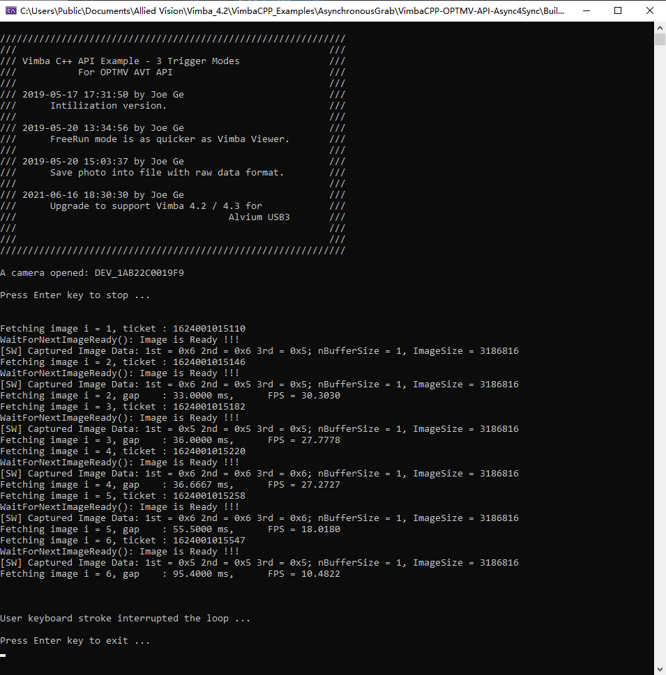

## Introduction 
Implement OPTMV Camera Interface API based on Vimba SDK C++ API.  
More details: https://github.com/avtcn/notes/blob/master/vimbasdk/vimba-cpp-3-programming-modes-api-console/vimba-cpp-3-programming-modes-api-console.md  

## Getting Started
* Vimba SDK
  Use the latest version, such as Vimba 4.2/4.3/5.0 on http://www.alliedvision.com/
* OPTMV Camera API or similar one
  The API includes following calls:
  1. OpenCamera()
  2. StartAcquire()
  3. Shot()
  4. StopAcquire()
  5. CloseCamera()

此SciCamera实现了一个AVT相机类，并实现如下接口：
1. `OpenCamera()` - 打开相机
2. `StartAcquire()` - 开始相机采集模式
3. `Shot()` - 拍照，此步骤可以一直连续使用下去（支持三种拍照模式：软件触发，硬件触发，自由采集）
4. `StopAcquire()` - 停止相机采集模式 
5. `CloseCamera()` - 打开相机


## Build and Test

  Put this example in following folder, such as:
  ```
C:\Users\Public\Documents\Allied Vision\Vimba_4.3\VimbaCPP_Examples\AsynchronousGrab\VimbaCPP-OPTMV-API-Async4Sync\

C:\Users\Public\Documents\Allied Vision\Vimba_5.0\VimbaCPP_Examples\AsynchronousGrab\VimbaCPP-OPTMV-API-Async4Sync\
  ```

  Compile Tool:  
    *Vision Studio 2017 Community*

  Cameras:  
    Allied Vision GigE Cameras, Such as Manta G895B, Alvium U-319m, Alvium U-1236m

## Screenshot


## Contribute
  For more information and help, please contact AVTCN AE Team (support@alliedvision.com).


## Version
  1. 2019-05-17 18:22:55 Joe Ge (joe.ge@alliedvision.com), initialized first version.
  2. 2021-06-16 18:45:36 Upgraded to Vimba 4.3/4.2
  3. 2021-11-23 11:07:53 Vimba 5.0 passed and Hardware trigger OK.

